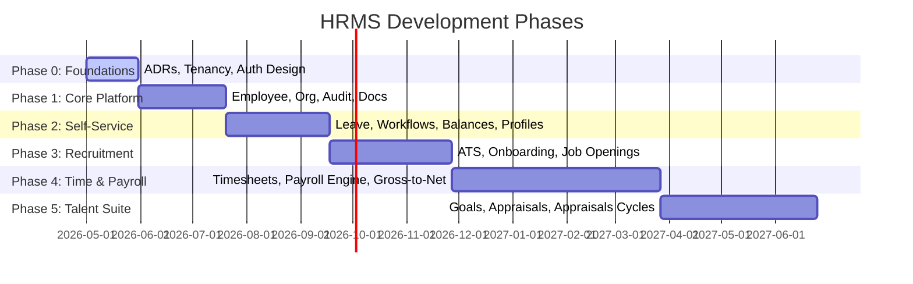

# HRMS Target Architecture, Bounded Domains, and Roadmap

This document serves as the target architecture blueprint, design reference, and long-term delivery roadmap for the internal Human Resource Management System (HRMS).

---

## 1. Recommended Target Architecture

### System Topology

```
                  Web / Mobile / Partner Systems
                                |
                        API Gateway / BFF
                                |
                  Identity + Tenant Resolution
                                |
                   HRMS Application Platform
               ┌───────────────────────────────────┐
               │ Employee Core                     │
               │ Organization & Positions          │
               │ Leave & Attendance                │
               │ Payroll                           │
               │ Recruitment / ATS                 │
               │ Performance & Goals               │
               │ Benefits                          │
               │ Documents                         │
               │ Approvals & Workflow              │
               │ Notifications                     │
               │ Reporting                         │
               │ Integration Hub                   │
               └───────────────────────────────────┘
                     |          |           |
                 PostgreSQL   Redis     Object Storage
                     |
              Transactional Outbox
                     |
               Event Bus / Kafka
                     |
         Analytics, Search, Payroll Partners,
           Identity Sync, Notifications, AI
```

### Suggested Technology Stack

| Area | Recommendation | Detail |
| :--- | :--- | :--- |
| **Backend Language** | Java 21+ or Kotlin | High-performance, modern JVM platform. |
| **Core Framework** | Spring Boot | Standard enterprise application container. |
| **Application Structure** | Spring Modulith | Monolithic deployment with strictly enforced boundaries initially. |
| **Primary Database** | PostgreSQL | Robust ACID compliance for transactional data (native UUIDv7, jsonb, partitioning). |
| **Cache** | Redis | Lookup and session caching, distributed locks, rate-limiting. |
| **Search** | OpenSearch or Elasticsearch | Full-text directory search and candidate mining. PostgreSQL remains source of truth. |
| **Event Streaming** | Kafka | Distributed integration backbone for outbox events, analytics, and service sync. |
| **Durable Workflows** | Temporal | Orchesration of multi-step, human-in-the-loop, or high-risk tasks. |
| **Identity** | Entra ID, Okta, Auth0, or Keycloak | Delegated identity management via OIDC / SAML 2.0. |
| **Authorization** | Internal Policy Service or OpenFGA/Cerbos | Multi-dimensional rules (RBAC + ABAC + Relationship-based). |
| **File Storage** | S3-compatible object storage | Decoupled binary storage (MinIO locally, AWS S3 in production). |
| **API Contract** | REST/OpenAPI first | Primary API interface; gRPC reserved for high-volume service-to-service communication. |
| **Observability** | OpenTelemetry | Vendor-neutral traces, metrics, and structured logging. |
| **Deployment** | Docker Containers / Kubernetes | Containerized workloads, migrating to K8s when scale justifies it. |
| **Infrastructure** | Terraform / OpenTofu | Declarative infrastructure as code. |
| **Secrets** | HashiCorp Vault / Cloud Secrets | Decoupled storage for connection strings, private keys, and credentials. |
| **Analytics** | CDC / Kafka events into lakehouse | Decoupled operational database from BI/analytics platforms. |

> [!NOTE]
> **Kafka Deployment Strategy:** Kafka should be used as the integration backbone eventually—not as your default method call replacement. Avoid dual-writing directly to PostgreSQL and Kafka; use the **Transactional Outbox** pattern to ensure consistency.

---

## 2. HR Domain Design & Boundaries

To prevent the application from degrading into a tightly coupled distributed monolith, business domains are isolated with strictly defined boundaries. Modules communicate only through published application services, commands, domain events, or read-only projections.

### 2.1 Foundation Domains (Build First)
These modules are the prerequisites for almost all subsequent business logic:
* **Tenant Management:** Multi-tenant context and metadata isolation.
* **Identity and Access:** SSO Integration, OIDC configurations, and authorization checks.
* **Employee Master:** Core personal data, biographical data, and worker profiles.
* **Organization Structure:** Legal entities, departments, business units, cost centers.
* **Position and Job Architecture:** Job families, grades, pay bands, position budgeting.
* **Effective-dated Data:** Temporal tracking mechanisms for mutable HR state.
* **Documents and Attachments:** Object storage integration, virus scanning, ACL-gated downloads.
* **Workflow and Approvals:** Orchestrated decision states, maker-checker boundaries, SLA timers.
* **Audit History:** Read/Write append-only journals.
* **Notification Service:** Multichannel delivery (Email, Slack, SMS).
* **Configuration and Custom Fields:** Tenant-level metadata configuration.

### 2.2 Business Domains (Build Second)
Built on top of the foundational schema:
* **Leave and Absence:** Accrual rules, balances, adjustments, calculations.
* **Time and Attendance:** Ingestion profiles, timesheets, shift constraints, calendar management.
* **Payroll:** Cutoff controls, gross-to-net pipelines, payslip generation, country plugins.
* **Compensation:** Salary structures, bonuses, equity records, equity vesting.
* **Benefits:** Enrollment windows, health plans, insurance deductions.
* **Recruitment and Onboarding:** ATS, candidate pipeline, offer letters, checklist completion.
* **Performance Management:** Goal tracking, appraisals, reviews, talent calibration.
* **Learning and Development:** Training assignments, course catalogues, certifications.
* **Expenses and Reimbursements:** Ingestion, receipts, approval pipelines, accounting sync.
* **Offboarding:** Exit checklists, clearance workflows, final settlements.
* **Workforce Planning:** Budget projections, headcount allocation forecasts.

---

## 3. Effective-Dated Data Model

HR systems require temporal consistency. Simple CRUD overrides will destroy historical compliance, reporting, audits, and payroll runs.

### Recommended Schema Fields
To represent temporal data, records maintain the following columns:
```sql
CREATE TABLE employee_compensation_history (
    id                 uuid           PRIMARY KEY DEFAULT uuidv7(),
    record_id          uuid           NOT NULL, -- Ties versions of the same logical record together
    business_entity_id uuid           NOT NULL,
    tenant_id          uuid           NOT NULL,
    effective_from     date           NOT NULL, -- Business time start
    effective_to       date           NULL,     -- Business time end (NULL represents the active future/present)
    version            integer        NOT NULL DEFAULT 1,
    status             text           NOT NULL,
    created_at         timestamptz    NOT NULL DEFAULT now(),
    created_by         uuid           NULL,
    change_reason      text           NULL,
    source             text           NULL,
    CONSTRAINT ck_date_range CHECK (effective_to IS NULL OR effective_to >= effective_from)
);
```

### Bitemporal History (Bitemporality)
For highly sensitive operations (e.g. Compensation, Manager Assignments, Tax Declarations), the system maintains both:
1. **Business Effective Time:** When the change takes effect in the real world.
2. **System Transaction Time:** When the system actually recorded or learned about the change.

---

## 4. Multi-Tenancy Strategy

Enterprise HR systems must guarantee data isolation. 

### Core Database Model
* **Shared Database / Shared Application:** Standard SaaS tier.
* **Mandatory Partitioning:** Every tenant-owned record has a `tenant_id` column.
* **Tenant Context:** ThreadLocal context holding active `tenant_id` set at the API Gateway / BFF level.
* **Row-Level Security (RLS):** PostgreSQL Row-Level Security serves as defense in depth beyond application filters.
  ```sql
  ALTER TABLE employee ENABLE ROW LEVEL SECURITY;
  CREATE POLICY tenant_isolation_policy ON employee
      FOR ALL
      USING (tenant_id = current_setting('app.current_tenant_id')::uuid);
  ```

### Isolation Tiers
1. **Tier 1 (Standard SaaS):** Shared application infrastructure, shared database.
2. **Tier 2 (Regulated):** Shared application infrastructure, dedicated schema or database instance.
3. **Tier 3 (Large Enterprise/Sovereign):** Fully dedicated deployment instance and database.

---

## 5. Identity and Authorization

### Authentication (IdP Delegation)
Avoid building password storage, OAuth authorization screens, or MFA yourself. Delegate authentication to a federated Identity Provider (Keycloak, Okta, Azure AD, etc.) supporting:
* OpenID Connect (OIDC) / SAML 2.0
* Enterprise Single Sign-On (SSO)
* System for Cross-domain Identity Management (SCIM) for auto-provisioning
* Session revocation triggers

### Authorization Model (Hybrid Control)
Basic Role-Based Access Control (RBAC) is insufficient for complex organizational visibility. Implement a hybrid model combining:
* **RBAC:** Global static scopes (`ROLE_HR_ADMIN`, `ROLE_RECRUITER`, `ROLE_EMPLOYEE`).
* **ABAC:** Attributes including country, department, legal entity, and employment classification.
* **Relationship-Based Access Control (ReBAC):** Checking manager paths (Direct/Indirect reports) derived dynamically from the organizational hierarchy.
* **Field-Level Security:** Redacting sensitive fields (e.g., compensation details or medical identifiers) based on authorization level.
* **Maker-Checker:** Ensuring the transaction creator cannot approve their own changes.

> [!IMPORTANT]
> **Server-Side Enforcement:** Enforce authorization rules strictly on the trusted backend service layer, never only in the UI. Aim to align with **OWASP ASVS 5.0.0 Level 2** baseline security controls.

---

## 6. Workflow and Approval Engine

HR actions are defined by multi-step human-in-the-loop workflows. 

### Key Engine Requirements
* Configurable sequential and parallel approval steps.
* Dynamic manager chain resolution (walking up the reporting tree).
* SLA timers, reminder schedules, automated escalations.
* Rejection, resubmission, cancellation, and transaction compensation (rollback).
* Complete, tamper-evident execution histories.

### Recommended Partitioning
* **Synchronous Short Operations:** Processed in-process via normal Spring Boot transactions.
* **Long-Running Orchestrations:** (e.g., Onboarding checklists, exit clearances, multi-manager salary approvals) must use **Temporal** to resist infrastructure failures and maintain durable process state.

---

## 7. Data and Event-Driven Architecture

### Transactional vs. Projections
* **Source of Truth:** Highly normalized PostgreSQL schema.
* **Read Models:** High-performing read projections built via Redis or views to feed dashboards and complex list views.
* **Search Projections:** OpenSearch cluster synchronized via domain events or CDC (Change Data Capture) outbox records.

### Document Management
All files are stored in S3-compatible Object Storage, with only metadata saved in PostgreSQL.
```
User → BFF → Auth/ACL Check → Get Presigned Upload/Download URL (5 min TTL) → S3
```
* **Antivirus Scanning:** Mandatory malware scans on uploads.
* **MIME Validation:** Hard checking file headers, not just extensions.
* **Audit Trail:** Every download/read of a document must produce an audit log.

### Domain Event Contract
Business occurrences must publish structured events to the outbox for propagation to Kafka:
```json
{
  "eventId": "9af1b8cc-a128-4e89-9a2e-50a80bb29124",
  "eventType": "EmployeeTransferred",
  "eventVersion": 1,
  "tenantId": "c8b123a1-12ef-4444-b222-302348509121",
  "aggregateId": "018f92bd-56f8-7b92-8051-60a80bbf2f02",
  "occurredAt": "2026-07-14T11:40:00Z",
  "correlationId": "f7d82b1c-c2b2-4d22-8322-90ab6182cba1",
  "causationId": "018f92bd-56fa-7b92-8052-60a80bbf3d03",
  "actor": {
    "userId": "018f92bd-56fb-7b92-8053-60a80bbf3e04",
    "roles": ["HR_ADMIN"]
  },
  "data": {
    "employeeId": "018f92bd-56f8-7b92-8051-60a80bbf2f02",
    "oldDepartmentId": "018f92bd-56fc-7b92-8054-60a80bbf3f05",
    "newDepartmentId": "018f92bd-56fd-7b92-8055-60a80bbf4f06",
    "transferReason": "Annual Restructuring"
  }
}
```

---

## 8. Payroll Bounded Context

Payroll calculations are highly critical and must be strictly isolated.
* **Cutoff Integrity:** Freeze input parameters after monthly cutoff dates.
* **Calculation Traceability:** Calculators must save calculation line items, formula versions, and inputs, rather than just final totals.
* **Reconciliation:** Self-auditing ledger reconciliations (e.g. gross pay minus deductions equals net pay) before locking runs.

---

## 9. AI Integration Guardrails

Do not sit AI systems directly on top of transaction databases.

### Recommended RAG & Tooling Topology
```
User → BFF → Auth/ACL Check → Tool Registry (Pre-approved APIs) → LLM → Output Validation
```
* **Tool-Calling Model:** AI must only interact through controlled, authenticated APIs (e.g. `getMyLeaveBalance()`, `findCompanyPolicy()`).
* **Zero Raw SQL Generation:** Do not allow the LLM to write database queries.
* **No Direct DB Mutations:** AI cannot directly update employee records or execute payouts.

---

## 10. Delivery Roadmap



### Phased Deliverables
* **Phase 0 (Foundation - 4-6 Weeks):** Tenancy strategy, effective-dating schemas, authorization models, ADR baselines.
* **Phase 1 (Platform - 6-10 Weeks):** Tenant onboarding, OIDC setups, Employee profiles, organization tree, document storage, transactional audit.
* **Phase 2 (Self-Service - 8-12 Weeks):** Leave policies, request approvals, personal dashboards.
* **Phase 3 (Recruitment - 10-14 Weeks):** Requisitions, onboarding check-lists, provisioning integrations.
* **Phase 4 (Payroll & Compensation - 4-8 Months):** Attendance ingestion, gross-to-net engine, tax rules, bank interface exports.
* **Phase 5 (Talent - 3-5 Months):** Performance goals, review cycles, succession planning.
* **Phase 6 (Intelligence & Ecosystem):** Data lakes, custom integrations, developer portal, AI assistants.

---

## 11. Target Directory Structure

The repository will be structured to scale cleanly as domain boundaries expand:

```
hrms-backend/
├── application/
│   ├── src/main/java/com/company/hrms/
│   │   ├── tenant/          -- Tenant management & context filters
│   │   ├── identity/        -- Federated authentication integration
│   │   ├── authorization/   -- Policy execution (RBAC, ABAC, ReBAC)
│   │   ├── employee/        -- Core employee records
│   │   ├── organization/    -- Legal entities, departments, business units
│   │   ├── position/        -- Job titles, grade limits, position budgets
│   │   ├── leave/           -- Accrual rules, balance records, requests
│   │   ├── attendance/      -- Clock intervals, timesheet calculations
│   │   ├── payroll/         -- Cutoff, net computation, ledger exports
│   │   ├── recruitment/     -- ATS candidate workflow
│   │   ├── onboarding/      -- Checklists, tasks, asset assignments
│   │   ├── performance/     -- Goal matrices, appraisal iterations
│   │   ├── workflow/        -- Temporal execution definitions
│   │   ├── document/        -- Object storage interface
│   │   ├── notification/    -- Multi-channel routing engine
│   │   ├── integration/     -- SCIM, Webhooks, event publishing
│   │   ├── reporting/       -- Projections & reporting models
│   │   └── shared/          -- Shared exceptions, base entity components
│   └── src/test/
├── workers/                 -- Dedicated task consumers / Temporal workers
├── database/
│   ├── migrations/          -- Version-controlled DB changes (Flyway)
│   └── seeds/               -- Test/Staging environment seed SQL data
├── contracts/
│   ├── openapi/             -- OpenAPI REST contract JSON/YAML specs
│   └── events/              -- Event contracts (JSON schema, Protobuf)
└── infrastructure/
    ├── terraform/           -- Infrastructure provisioning code
    ├── kubernetes/          -- Resource manifest definitions
    └── observability/       -- OpenTelemetry setups, dashboard configs
```
